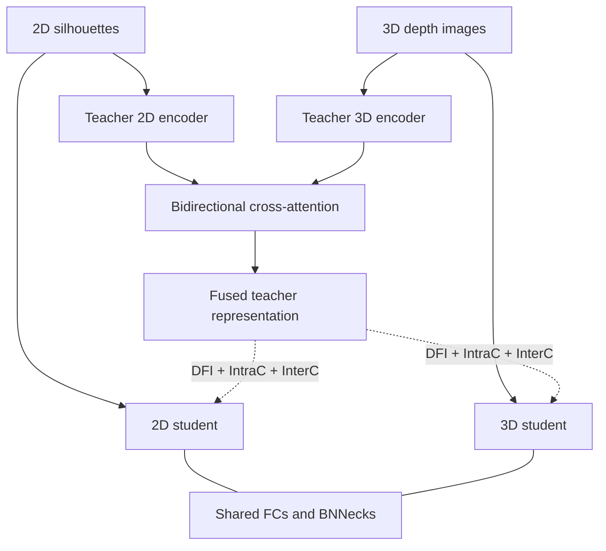

# Method and equation mapping

This note maps the final TMM paper to the reference implementation. Tensor
shapes follow OpenGait: embeddings are `[B, C, P]`, classifier logits are
`[B, K, P]`, and sequence features are `[B, C, S, H, W]`.

## Teacher: Eqs. (2)-(7)

`CrossModalAttention2D` treats each spatial pixel as a token and implements
scaled multi-head cross-attention in both directions. The two attended feature
maps are concatenated and passed through `MLP → BN → LeakyReLU → MLP`, matching
Eq. (6). Temporal max pooling occurs before fusion; HPP and `SeparateFCs`
produce the part-based teacher representation afterward.

The cleaned paper path does not add the raw modality feature maps as residuals
to the cross-attention outputs. Such residual additions appeared in the
research snapshot but are not present in Eqs. (3)-(6).

## Students: Eqs. (8)-(10)

The camera and depth branches use separate ResNet encoders followed by temporal
pooling and HPP. They share a single `SeparateFCs` projection and a single
`SeparateBNNecks` classifier. No `CommonSpaceShifting` block or feature adaptor
is inserted in the final reference path because neither appears in the paper's
student architecture.

## Feature distillation: Eqs. (11)-(16)

For teacher part `t_p` and student part `s_p`, DFI is

$$
\mathcal{L}_{\mathrm{DFI}} = 1 - \frac{1}{P}\sum_{p=1}^{P}
\frac{t_p^\top s_p}{\lVert t_p\rVert_2\lVert s_p\rVert_2}.
$$

This transfers direction rather than scale. `direction_feature_imitation()` is
the direct implementation.

InterC first max-pools the parts to a holistic vector, forms the batchwise
cosine-affinity matrix, and minimizes the elementwise mean absolute difference
between teacher and student matrices. IntraC forms a `P × P` cosine-affinity
matrix inside each sample and applies the same mean absolute difference.

## Distillation Balancing: Eqs. (17)-(19)

At temperature $\tau=4$, the true-class confidence of each branch is averaged
over samples and parts to produce $\theta_{2d}$ and $\theta_{3d}$. The common
`1 / num_classes` term in Eq. (18) cancels in the ratios below:

$$
\mu_{2d}=\frac{1}{2}\left(1+\tanh\frac{\theta_{3d}}
{\theta_{2d}+\theta_{3d}}\right), \qquad
\mu_{3d}=\frac{1}{2}\left(1+\tanh\frac{\theta_{2d}}
{\theta_{2d}+\theta_{3d}}\right).
$$

The opposite branch controls each weight by design: if 2D is weaker, the
stronger 3D confidence raises `mu_2d`. Both factors lie in `(0.5, 0.8808)`.
The author snapshot lets gradients pass through DB; `detach_balance: false`
preserves that behavior, while the switch supports controlled experiments.

## Warm-up and objectives: Eqs. (20), (25)-(28)

The warm-up factor is clamped to the configured training interval:

$$
\phi_i = \phi_{min} + (\phi_{max}-\phi_{min})\frac{i}{n_{iters}},
\quad \phi_{min}=0.1,\;\phi_{max}=1.5.
$$

Stage 1 uses triplet and identity cross-entropy losses with weight 1. Stage 2
uses DFI/IntraC/InterC component weights `1.0/0.5/0.5`, applies `phi * mu_m`
per modality, and adds bidirectional cross-modal triplet loss. The YAML assigns
0.5 to each triplet direction so their sum is the directional mean.

The student YAML enables identity cross-entropy because it is active in the
authors' training snapshot and provides the BNNeck classifier used by DB. Since
the compact Eq. (28) does not explicitly list this term, setting
`use_student_ce: false` selects the literal equation-only path.

## Inference

The teacher is removed during inference. Camera and depth embeddings from the
students are compared with part-wise cosine distance. The supplied evaluator
implements both directions under the SUSTech1K probe/gallery protocol.
